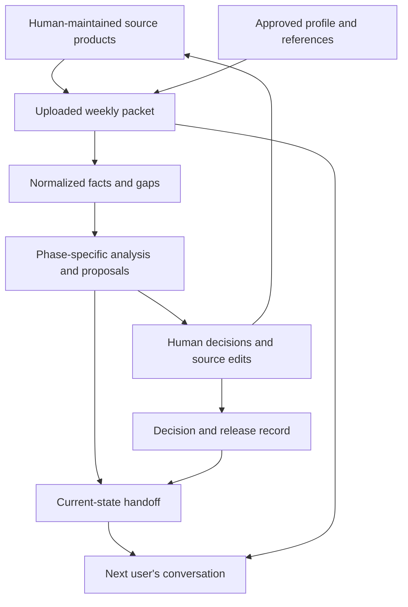

# Architecture — Fighter Squadron Scheduling Assistant

This describes the v0.4 document-based system and its extension points. It is an architectural map, not a new source of scheduling policy. Operators start with [README.md](README.md); repository contributors also follow [AGENTS.md](AGENTS.md). Approved decisions and exact local rules remain in their designated documents.

## System boundary

The product is a reusable instruction and input package for a human-led workflow in ChatGPT Mil. It is not a scheduling application, optimizer service or authoritative database. It has no required server, API, connector, autonomous agent, custom code or shared multiuser chat. The assistant operates on supplied documents and conversation; humans maintain the actual schedule and operational products in their existing tools.

The repository holds reusable instructions, blank forms, approved local workflow references and synthetic examples. Actual weekly packets, rosters, operational reports and handoffs stay outside it. Repository file edits are development work; they are distinct from prohibited autonomous modification of operational source files.

## Components and ownership

| Component | Repository location | Responsibility |
| --- | --- | --- |
| Operator entry point | [README.md](README.md) | Two complete ZIP downloads and the existing-setup update |
| Initial squadron setup | [Setup guide](docs/v0.4/first-time-setup.md) and [blank local-profile starter](templates/setup/local_profile_template.md) | Shared-drive organization, source inventory and human-confirmed local products before weekly use |
| Contributor instructions | [AGENTS.md](AGENTS.md) | Reading order, change discipline, policy preservation and verification |
| Reusable behavior | [System primer](docs/v0.4/system-primer.md) | Phase controls, evidence handling, analysis, human authority and output contracts |
| Local policy | [Pantons profile](local-profiles/pantons-v0.4.md) | Exact Pantons scheduling rules; another squadron supplies its own approved profile |
| Workflow explanation | [Phase guide](docs/v0.4/phase-guide.md) | Contributors, provisional inputs, outputs, decisions and advancement conditions |
| Report contract | [Report contracts](docs/v0.4/report-contracts.md) | Consistent phase-specific summaries and compact records |
| Input and state forms | [Templates](templates/v0.4) | Optional structured containers for information not already supplied elsewhere |
| Governance and history | [Design decisions](docs/v0.4/design-decisions.md), [crosswalk](docs/v0.4/policy-crosswalk.md), [change log](CHANGELOG.md) | Approved design, baseline preservation and change rationale |
| Validation | [Validation plan](docs/v0.4/validation-plan.md), [QC record](docs/v0.4/repository-qc.md) | Behavioral cases, historical pilot procedure and bounded evidence of checks performed |
| Worked fixtures | [Synthetic examples](examples/v0.4) | Fictional demonstrations and test stimuli, never issued direction |

The primer and approved local profile are loaded together for operational use. The stable-reference packet supplies the actual governing publications, dates and parameters. The approved playbook supplies enduring lessons. Weekly DO guidance supplies time-bounded direction. Architectural summaries do not replace any of these sources or authorize resolving a conflict silently.

## Information flow

The arrows are human workflow, not automated integrations. The assistant drafts analysis, forms and handoffs. A human saves or transfers those products and applies source edits. The receiving conversation needs the current actual source products; handoff text and transcript references do not transfer file access.

### Evidence layer

Each material normalized fact retains its source location, status and extraction confidence. Facts, interpretations and recommendations remain distinct. A missing or conflicted source limits the affected check; unaffected work continues. Schedulers choose when drafting begins despite gaps.

A scoped human confirmation can close an identified concern without another upload or proof requirement. The record distinguishes Human-confirmed from assistant verification. It does not silently turn a recommendation into DO direction or bypass the separately required DO and waiver-authority decisions.

### Analysis layer

The phase selects the work and churn posture. The assistant consolidates inputs before drafting, reviews human-built lineups, prepares sell decisions, checks corrections, and recommends reflows. Exact local constraints and complete downstream feasibility checks govern proposals. The assistant does not implement or approve those proposals.

BRIEF versus DETAILED changes report depth. CONFIRM versus CONFLICTS ONLY changes fact-ledger display and validation flow. Neither changes the underlying scheduling rules.

### Human authority layer

Sell directions are recorded and implemented by schedulers. Assistant QC precedes formal DO buy of the corrected version. Human publication follows. These are distinct recorded events, even when close together in time.

During execution, daily scheduler and Top 3 sign-off covers feasible personnel/mission changes inside published times, turn pattern, coordinated support and DO guidance. Changes outside those boundaries return to the DO. Every waiver goes through the DO and applicable waiver authority. A schedule's approval status cannot be inferred from a phase label or from an assistant report.

## State model: three independent dimensions

The system uses explicit document fields, not a software state machine.

| Dimension | Meaning | Critical distinction |
| --- | --- | --- |
| Workflow phase | Gathering, initial draft, sell, corrections/QC/approval/publication, execution reflows | Work status and human direction control transitions, not weekday |
| Artifact/decision status | Working draft, presented, corrected, bought, published, signed daily, unapproved proposal | A phase does not automatically confer approval on a version |
| Test condition and cutoff | Operational, historical blind review, retrospective | Later hindsight is prohibited in a blind test regardless of workflow phase |

The normal sequence is product gathering → human initial draft → sell directions → corrections and QC → formal buy → publication → execution reflows. Work may overlap or return to an earlier phase explicitly. Completed execution is actual history; a reflow changes remaining commitments, not past events.

## Weekly records and identifiers

| Record | Template | Role |
| --- | --- | --- |
| Run control and source manifest | [01](templates/v0.4/01_run_control_and_manifest.md) | Week/as-of, phase, cutoff, file identity and baseline roles |
| DO and Flt CC inputs | [02](templates/v0.4/02_do_weekly_guidance.md), [03](templates/v0.4/03_flight_commander_input.md) | Additional guidance, recommendations and discrepancies; no duplicate tracker transcription |
| Stable reference index | [04](templates/v0.4/04_stable_local_rules_and_references.md) | Approved source locations, parameters and effective dates |
| Retrospective outcomes | [05](templates/v0.4/05_retrospective_outcomes.md) | Later results used after a locked historical blind report |
| Decision and release record | [06](templates/v0.4/06_decision_and_release_record.md) | Sell dispositions, confirmations, waivers, buy, publication and daily sign-offs |
| Execution update | [07](templates/v0.4/07_execution_update.md) | Completed/remaining/conditional events and changed facts |
| Session handoff | [08](templates/v0.4/08_session_handoff.md) | Compact current state for another user or conversation |
| Approved playbook | [09](templates/v0.4/09_playbook.md) | Standing rules and preserved candidate decision history |

F-, E-, R-, D-, W- and X-identifiers connect facts, events, recommendations, decisions, waivers and changed facts within a weekly record. C- and PB-identifiers connect enduring playbook candidates and approved rules across weeks. These are human-readable cross-references, not database keys or a requirement to rebuild source products in a new format. Keep IDs stable across corrections and handoffs.

The decision record is the common reference for a decision's substance and disposition. Other forms reference it rather than maintain conflicting copies. Playbook candidate Pending/Approved/Rejected status is separate from the workflow status of a weekly correction.

## Version and baseline model

| Use | Comparison source |
| --- | --- |
| Initial draft review | Human-selected earlier draft, or explicit None for the first draft |
| Post-sell correction QC | Sell-presented version; previous corrected version for useful incremental differences |
| Buy/publication reconciliation | Exact bought versus exact distributed artifacts |
| Immediate execution change | Latest signed daily for each affected date; published weekly fallback when no daily exists |
| Cumulative execution departure | Identified authoritative published weekly schedule |

The active analysis file can be a proposal; it does not automatically replace an approved baseline. Multi-day reflows require date-specific immediate baselines. A newly signed daily revision becomes current when humans identify it as such. A republished weekly schedule requires explicit baseline selection so history is not silently reset.

## Continuity and historical testing

First-time squadron setup is an administrative planning conversation, not a sixth operational phase. The shared-drive recommendation separates the downloaded kit, current local configuration, weekly working products and historical test material. It does not create drive access, approval status or automatic synchronization. Setup drafts remain distinct from confirmed facts and approved rules; a new weekly chat loads the actual current products once an execution week is chosen.

Prefer one conversation per execution week. When a user/session changes, transfer a current-state Word-compatible handoff and the current source packet. Preserve exact DO decisions, confirmation scope, version roles, completed actuals, open issues and candidate statuses. Full transcripts are optional reference; multiple chats do not automatically synchronize or merge their proposals.

For historical blind tests, every input, handoff and transcript must respect the declared cutoff. Actuals already knowable at a historical execution cutoff are valid; later outcomes are not. Exposure to prohibited hindsight requires an isolated clean restart, not a request to ignore what was seen. The full synthetic walkthrough includes later outcomes and must not be used intact as an earlier-cutoff blind packet.

## Extension and maintenance

For another squadron, retain reusable workflow and substitute a human-approved local profile and reference packet. Do not copy Pantons event limits, approval roles or training conventions as universal military rules.

For a new behavior, identify the approving decision, then update the affected primer/profile, operator prompt, forms/report contracts, example and validation case together. Use Git history for earlier releases; do not keep repository archives. Number package releases deliberately. Users apply the latest manual update when starting next week; they do not copy system versions into each weekly folder. Local profile/playbook versions and exact schedule baseline identities remain explicit.

No executable runtime, automated scheduling test suite or CI gate is required by this architecture. Static document checks establish structural consistency only. Behavioral cases require actual model outputs, and historical utility requires human adjudication. Keep Not run separate from Passed, and do not treat an earlier QC record as proof for later edits. Optional future software or platform integrations must preserve these human authority and portability boundaries and require an explicitly agreed scope.

## Distribution and installed folders

Maintainers edit Markdown sources and run the small Python packaging utility; operators need only Word and ChatGPT Mil. The utility is not an operational prerequisite. [Packaging instructions](packaging/README.md) define generation and release checks.

Each full ZIP contains START HERE.docx, System (startup primer, numbered guides, blank forms and references), Local Guidance (Pantons approved seed or a blank adopting-squadron draft), and COPY THIS FOLDER FOR EACH NEW WEEK. Humans create weekly Inputs, Schedules and Working Record folders from that template.

The single update ZIP contains System, START HERE.docx and update instructions. It excludes all local guidance and weekly folders by construction. Replacing System next week updates reusable instructions without rewriting local policy. Current downloads are committed with their source changes for review. Old copies live only in Git history. No automatic deployment or shared-drive access exists.
