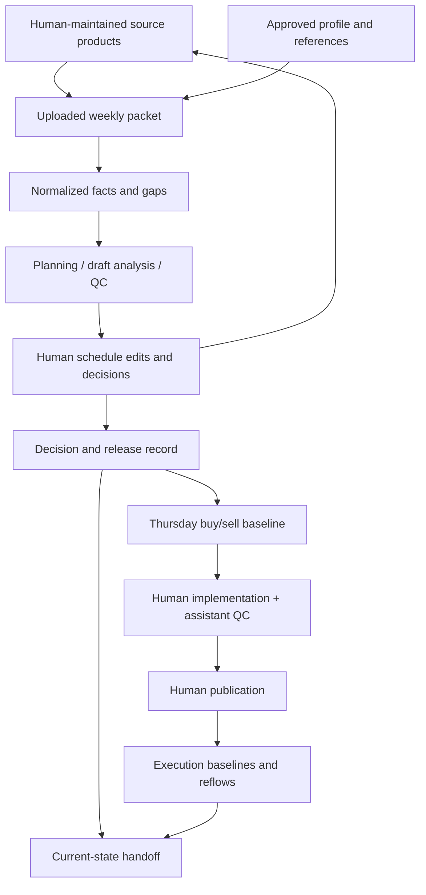

# Architecture — Fighter Squadron Scheduling Assistant

This describes the document-based scheduling-assistant architecture and its extension points. It is an architectural map, not a second source of scheduling policy. Operators start with [README.md](README.md); contributors also follow [AGENTS.md](AGENTS.md). Approved workflow decisions and exact local rules remain in their designated documents.

## System boundary

The product is a reusable instruction and input package for a human-led workflow in GenAI.mil. It is not a scheduling application, optimizer service or authoritative database. It has no required server, API, connector, autonomous agent, custom code or shared multiuser chat. The assistant operates on supplied documents and conversation; humans maintain the actual schedule and operational products in their existing tools.

The repository holds reusable instructions, blank forms, approved local workflow references and synthetic examples. Actual weekly packets, rosters, operational reports and handoffs stay outside it. Repository file edits are development work; they are distinct from prohibited autonomous modification of operational source files.

## Components and ownership

| Component | Repository location | Responsibility |
| --- | --- | --- |
| Operator entry point | [README.md](README.md) | Complete setup ZIPs, existing-setup update and weekly battle rhythm |
| Day-based operator guides | `packaging/guides/` | Maintained sources for the numbered Word manual from Monday inputs through execution, handoff, update and setup checks |
| Initial squadron setup | [Setup guide](docs/v0.4/first-time-setup.md) and [blank local-profile starter](templates/setup/local_profile_template.md) | Shared-drive organization, source inventory and human-confirmed local products before weekly use |
| Contributor instructions | [AGENTS.md](AGENTS.md) | Reading order, change discipline, policy preservation and verification |
| Reusable behavior | [System primer](docs/v0.4/system-primer.md) | Internal phase controls, evidence handling, analysis, human authority and output contracts |
| Local policy | [Pantons profile](local-profiles/pantons-v0.4.md) | Exact Pantons scheduling rules; another squadron supplies its own approved profile |
| Workflow reference | [Phase guide](docs/v0.4/phase-guide.md) | Relationship between chronological operator steps and internal phase/status controls |
| Report contract | [Report contracts](docs/v0.4/report-contracts.md) | Consistent task/phase summaries and compact records |
| Input and state forms | [Templates](templates/v0.4) | Optional structured containers for information not already supplied elsewhere |
| Governance and history | [Design decisions](docs/v0.4/design-decisions.md), [crosswalk](docs/v0.4/policy-crosswalk.md), [change log](CHANGELOG.md) | Approved design, baseline preservation and change rationale |
| Validation | [Validation plan](docs/v0.4/validation-plan.md), [QC record](docs/v0.4/repository-qc.md) | Behavioral cases, historical pilot procedure and bounded evidence of checks performed |
| Worked fixtures | [Synthetic examples](examples/v0.4) | Fictional demonstrations and test stimuli, never issued direction |

The primer and approved local profile are loaded together for operational use. Stable references supply governing publications, dates and parameters. The approved playbook supplies enduring lessons. Weekly DO guidance supplies time-bounded direction. Architectural summaries do not replace those sources.

## Operator navigation versus internal state

The **operator manual is chronological** because schedulers need to know what to open for the work they are doing. The current generated Word instruction set is:

1. First time setup
2. Monday — Inputs Due
3. Tuesday — Start the Week
4. Tuesday — Plan the Week
5. Wednesday — Build the Schedule
6. Thursday — Full Schedule QC
7. Thursday — Optional DO Adversarial Review
8. Thursday — Schedule Buy-Sell
9. Thursday–Friday — Apply Buy-Sell Changes
10. Friday — Final QC and Publish
11. Execution Week — Reflows
12. Hand Off an Active Week
13. Update for Next Week
14. Check the Setup

The assistant still tracks five **internal phases** selected by actual work status rather than weekday:

| Phase | Internal scope |
| --- | --- |
| 1 PRODUCT GATHERING | Intake, gaps and Tuesday planning |
| 2 INITIAL DRAFT | Wednesday build support and Thursday full QC |
| 3 SCHEDULE BUY/SELL | Thursday decision package, explicit DO buy and recorded directions |
| 4 POST-BUY/SELL IMPLEMENTATION / FINAL QC / PUBLICATION | Human implementation, assistant QC, supplemental DO decisions when necessary, Friday publication |
| 5 EXECUTION REFLOWS | Execution-week changes and downstream consequences |

A holiday, late input or reopened draft does not change state just because the calendar changed.

## Information flow

The arrows are human workflow, not automated integrations. The assistant drafts analysis, forms and handoffs. Humans save/transfer those products and make source edits. A receiving conversation needs the current actual source files; handoff text does not transfer file access.

### Evidence layer

Each material normalized fact retains its source location, status and extraction confidence. Facts, interpretations and recommendations remain distinct. A missing or conflicted source limits the affected check; unaffected work continues. Schedulers choose when drafting begins despite gaps.

A scoped human confirmation can close an identified concern without another upload or proof requirement. The record distinguishes Human-confirmed from assistant verification. It does not silently turn a recommendation into DO direction or bypass a waiver authority.

### Analysis layer

The internal phase selects the work and churn posture. The assistant consolidates inputs before drafting, supports human-built lineups, performs a deliberate Thursday whole-schedule QC, prepares the buy/sell decision brief, checks post-buy/sell implementation and recommends execution reflows. Exact local constraints and complete downstream feasibility checks govern proposals. The assistant does not implement or approve them.

BRIEF versus DETAILED changes report depth. CONFIRM versus CONFLICTS ONLY changes fact-ledger display/validation flow. Neither changes scheduling rules or authority.

### Human authority layer

**Thursday's schedule buy/sell is the formal DO buy event when the DO explicitly approves the weekly schedule.** The approved buy/sell baseline is the exact presented version plus explicit DO directions recorded in the meeting. The fact that a meeting occurred is not itself approval.

Schedulers implement the recorded directions afterward and the assistant checks faithful implementation plus second/third-order effects. There is **no routine second DO buy**. If implementation is infeasible or requires a materially different solution outside the recorded direction, the specific issue returns to the DO for a supplemental decision. Friday publication is a separate human action.

During execution, daily scheduler and Top 3 sign-off covers feasible personnel/mission changes inside published times, turn pattern, coordinated support and DO guidance. Changes outside those boundaries return to the DO. Every waiver goes through the DO and applicable waiver authority. Approval cannot be inferred from a phase label or assistant report.

## State model: three independent dimensions

The system uses explicit document fields, not a software state machine.

| Dimension | Meaning | Critical distinction |
| --- | --- | --- |
| Workflow phase | Gathering, initial draft, buy/sell, post-buy/sell implementation/QC/publication, execution reflows | Work status and human direction control transitions, not weekday |
| Artifact/decision status | Working draft, presented, buy/sell-approved baseline, corrected implementation, published, signed daily, unapproved proposal | A phase does not automatically confer approval on a version |
| Test condition and cutoff | Operational, historical blind review, retrospective | Later hindsight is prohibited in a blind test regardless of workflow phase |

The normal sequence is product gathering → human initial draft → Thursday QC → optional DO challenge → Thursday buy/sell → implementation/QC → Friday publication → execution reflows. Work may overlap or explicitly return to an earlier state. Completed execution is actual history; reflow changes remaining commitments, not past events.

## Weekly records and identifiers

| Record | Template | Role |
| --- | --- | --- |
| Run control and source manifest | [01](templates/v0.4/01_run_control_and_manifest.md) | Week/as-of, phase, cutoff, file identity and baseline roles |
| DO and Flt CC inputs | [02](templates/v0.4/02_do_weekly_guidance.md), [03](templates/v0.4/03_flight_commander_input.md) | Additional guidance, recommendations and discrepancies; no duplicate tracker transcription |
| Stable reference index | [04](templates/v0.4/04_stable_local_rules_and_references.md) | Approved source locations, parameters and effective dates |
| Retrospective outcomes | [05](templates/v0.4/05_retrospective_outcomes.md) | Later results used after a locked historical blind report |
| Decision and release record | [06](templates/v0.4/06_decision_and_release_record.md) | Buy/sell approval/directions, implementation dispositions, supplemental decisions, waivers, publication and daily sign-offs |
| Execution update | [07](templates/v0.4/07_execution_update.md) | Completed/remaining/conditional events and changed facts |
| Session handoff | [08](templates/v0.4/08_session_handoff.md) | Compact current state for another user/conversation |
| Approved playbook | [09](templates/v0.4/09_playbook.md) | Standing rules and preserved candidate decision history |

F-, E-, R-, D-, W- and X-identifiers connect facts, events, recommendations, decisions, waivers and changed facts within a weekly record. C- and PB-identifiers connect enduring playbook candidates and approved rules across weeks. These are human-readable cross-references, not database keys.

## Version and baseline model

| Use | Comparison / authority source |
| --- | --- |
| Initial draft review | Human-selected earlier draft, or explicit None for the first draft |
| Thursday buy/sell | Exact presented version plus explicit DO buy statement and recorded D-### directions |
| Post-buy/sell implementation QC | Buy/sell-presented version; previous corrected version when useful |
| Publication reconciliation | Exact distributed artifact compared to the buy/sell baseline plus any supplemental DO decisions |
| Immediate execution change | Latest signed daily for each affected date; published weekly fallback when no daily exists |
| Cumulative execution departure | Identified authoritative published weekly schedule |

The active analysis file can be a proposal; it does not automatically replace an approved baseline. Multi-day reflows require date-specific immediate baselines. A newly signed daily revision becomes current when humans identify it as such. A republished weekly schedule requires explicit baseline selection so history is not silently reset.

## Continuity and historical testing

First-time squadron setup is an administrative planning conversation, not a sixth operational phase. Setup drafts remain distinct from confirmed facts and approved rules; a new weekly chat loads current products once an execution week is chosen.

Prefer one main conversation per execution week. When an active week changes users/sessions, transfer a current-state Word-compatible handoff and current source packet. Preserve exact DO decisions, confirmation scope, version roles, completed actuals, open issues and candidate statuses. Full transcripts are optional reference; multiple chats do not automatically synchronize.

For historical blind tests, every input, handoff and transcript must respect the declared cutoff. Actuals already knowable at a historical execution cutoff are valid; later outcomes are not. Exposure to prohibited hindsight requires an isolated clean restart. The full synthetic walkthrough includes later outcomes and must not be used intact as an earlier-cutoff blind packet.

## Extension and maintenance

For another squadron, retain the reusable workflow and substitute a human-approved local profile/reference packet. Do not copy Pantons event limits or training conventions as universal rules.

For a new behavior, identify the approving decision, then update affected primer/profile, operator prompts, forms/report contracts, example and validation cases together. Persistent installed-state changes require a package-version bump and append-only migration declaration. Use Git history for earlier releases; do not keep repository archives.

Static document/package checks establish structural consistency only. Behavioral cases require actual model outputs, and historical utility requires human adjudication. Keep Not run separate from Passed.

## Distribution and installed folders

Maintainers edit Markdown sources and run the Python packaging utility; operators need only Word and GenAI.mil. The utility is not an operational prerequisite. [Packaging instructions](packaging/README.md) define generation and release checks.

Each full ZIP contains START HERE.docx, System (startup primer, day-based numbered guides, blank forms and references), Local Guidance (Pantons approved seed or a blank adopting-squadron draft), and COPY THIS FOLDER FOR EACH NEW WEEK. Humans create weekly Inputs, Schedules and Working Record folders from that template.

The update ZIP replaces System and START HERE at the next-week boundary. It excludes Local Guidance and weekly work by construction. When a release deliberately changes a persistent profile seed or layout, PERSISTENT MIGRATIONS.docx and reference-only copies support human review/merge rather than automatic overwrite.

Publishing a GitHub Release triggers the maintainer workflow to build from the exact tagged source, run checks, attach the ZIPs/manifest/checksums and append verified download links to release notes. Generated downloads live in Releases, outside the repository tree. No branch writeback, automatic installation or shared-drive access exists.
